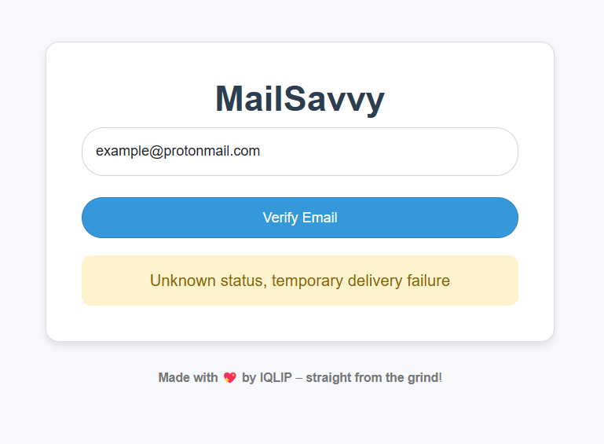

# MailSavvy: Email Verification Tool

MailSavvy is a Flask-based web application designed to verify email addresses by performing DNS MX record lookups and SMTP communication. The tool provides a user-friendly interface, offering real-time feedback on email validity. Ideal for educational purposes and foundational use cases, MailSavvy serves as a robust starting point for building more advanced email validation workflows.

---

## Features

- **DNS MX Record Lookup**  
  Checks if the domain of the provided email has valid mail exchange (MX) records.

- **SMTP Communication**  
  Verifies an email address by interacting with the domain's SMTP server.

- **Web-Based Interface**  
  A minimalistic and responsive UI for easy email verification.

- **Real-Time Feedback**  
  Displays validation results categorized as:
  - **Valid** : Email address exists and is valid.
  - **Invalid** : Email address does not exist or is undeliverable.
  - **Error** : Temporary or server-related issues encountered during verification.(e.g., no MX records, unreachable server).

- **Lightweight and Easy to Deploy**  
  Built with Flask, making it simple to set up and use.

---

## Screenshot Previews

### **Vaild Email**

The tool successfully verifies the email address:  

### **Invalid Email**
The tool detects an invalid or undeliverable email address:

### **Error**
An error occurs during the verification process (e.g., no MX records or server issues):

